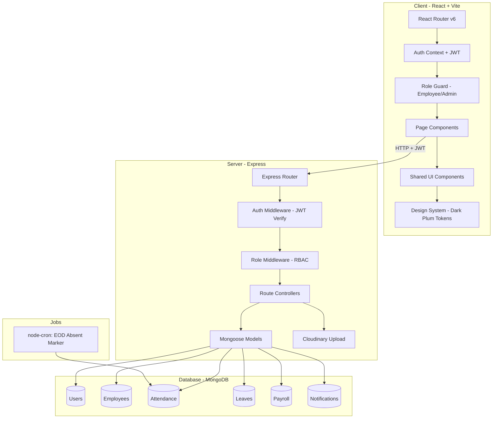
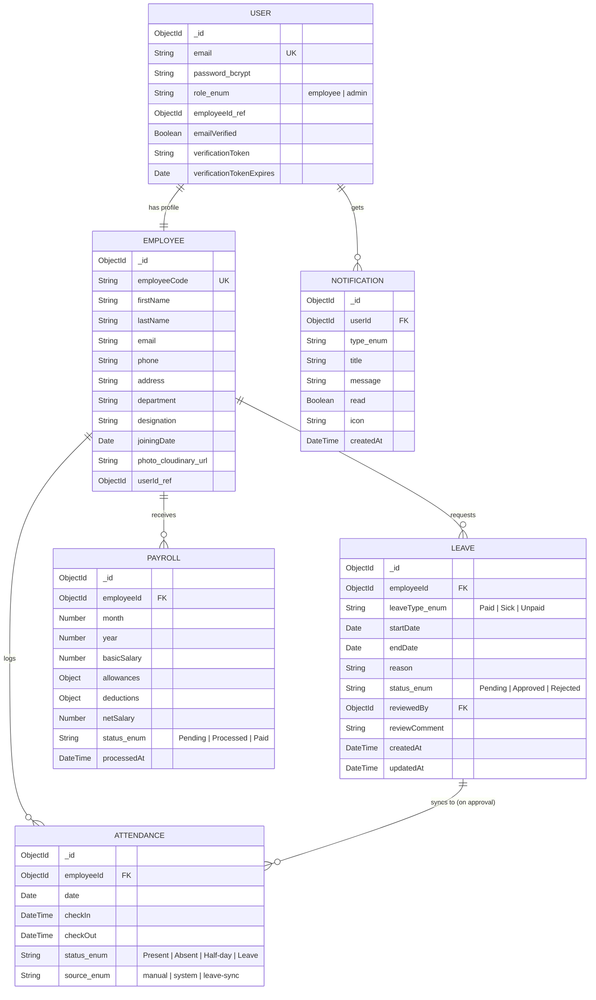

# Dayflow HRMS — Implementation Plan (Rev 2)

> **"Every workday, perfectly aligned."**
> Production-grade HRMS for the Odoo × NMIT Bangalore Hackathon 2026.

---

## Revision Log

| # | Finding | Resolution |
|---|---------|------------|
| 1 | Missing `PUT /api/employees/:id` (admin, all fields) | Added to Phase 2 server routes |
| 2 | No email-verification representation | Added verification token + "verify your email" UI state to Phase 1 |
| 3 | Absent/Half-day computation undefined | Decided: **scheduled job** (end-of-day) — analysis below |
| 4 | Leave↔Attendance sync undefined | Decided: **write-through on approval** — analysis below |
| 5 | Directory access & photo uploads asked after assuming | Resolved: employees see directory (limited fields); photos via **Cloudinary + multer** |
| 6 | Refresh-token claim with no implementation | Dropped from tech rationale — JWT access-token only for hackathon scope |
| 7 | Toast.jsx missing warning variant | Added warning/amber variant |
| 8 | Seed data too late (Phase 5) | Moved minimal seed to Phase 1; full seed richness remains Phase 5 |

---

## Architecture Overview



### Tech Stack

| Layer | Technology | Rationale |
|---|---|---|
| Frontend | React 18 + Vite | Fast HMR, modern bundling, great DX |
| Routing | React Router v6 | Nested routes, layout routes, route guards |
| State | React Context + useReducer | Sufficient for HRMS scale, no extra deps |
| Charts | Recharts | Declarative JSX API, SVG-based, best React integration. **Chart palette wired from CSS custom properties**: `--color-brand`, `--color-muted-plum`, `--color-dusty-mauve` for series 1/2/3 |
| HTTP | Axios | Interceptors for attaching JWT from localStorage on every request. **No refresh-token flow** — single access token with reasonable expiry (24h) for hackathon scope |
| Styling | Vanilla CSS (CSS custom properties) | Full control over Dark Plum design tokens |
| Backend | Express.js | Proven, lightweight, vast middleware ecosystem |
| Database | MongoDB + Mongoose | Schema flexibility, user preference, fast prototyping |
| Auth | JWT (access token only) + bcrypt | Stateless auth, password hashing. No refresh tokens — simplicity for demo |
| Validation | express-validator (server) | Server-side validation on every protected route |
| File upload | multer + Cloudinary | Profile photo upload to cloud CDN, returns URL stored in Employee model |
| Scheduling | node-cron | End-of-day absent marker job |
| Notification delivery | 30s polling | See analysis below |

---

## Technical Decisions — Analysis Protocol

### Decision 1: Notification Delivery — Polling vs SSE vs WebSockets

| Approach | Latency | Complexity | Hackathon fit |
|---|---|---|---|
| **30s polling** (GET every 30s) | ~30s worst case | Trivial — one `setInterval` + fetch | ✅ Best |
| SSE (Server-Sent Events) | Real-time | Moderate — needs event emitter infra, reconnection handling, CORS config | Overkill for demo |
| WebSockets (Socket.io) | Real-time | High — new dependency, connection management, scaling concerns | Overkill for demo |

**Decision:** 30s polling. Notifications in an HRMS are not chat messages — a 30s delay on "your leave was approved" is imperceptible. The complexity cost of SSE/WS is unjustified for hackathon scope. If this were production, SSE would be the next step (lower overhead than WS, unidirectional is sufficient).

---

### Decision 2: Absent/Half-day Computation — Cron vs Computed-on-Read

| Approach | Pros | Cons |
|---|---|---|
| **Scheduled job (node-cron, EOD)** | Simple query: "find employees with no attendance today, insert Absent." Data is concrete in DB — dashboards/reports are plain reads. | Requires the server to be running at EOD; if server is down, absences aren't marked until restart catch-up. |
| Computed-on-read (virtual aggregation) | No scheduled job needed; always accurate based on current date vs attendance records. | Every attendance read becomes an aggregation pipeline; complex to get right for date ranges; performance degrades with scale; "Absent" records don't exist in DB so you can't query/filter them naturally. |

**Decision:** Scheduled job via `node-cron`.
- Runs at 23:55 daily: queries all employees, finds those with no attendance record for today and no approved leave covering today, inserts `{status: 'Absent'}` records.
- Half-day: if `checkIn` exists but `checkOut` is missing or total hours < 4, status is updated to `Half-day`.
- On server startup, catch-up logic runs for any missed days (handles server downtime).
- **Risk:** Clock-dependent. **Mitigation:** Catch-up on startup + manual admin trigger endpoint `POST /api/attendance/reconcile` (admin only).

---

### Decision 3: Leave↔Attendance Sync — Write-through vs Joined Read

| Approach | Pros | Cons |
|---|---|---|
| **Write-through on approval** | When admin approves leave, controller immediately creates Attendance records with `status: 'Leave'` for each date in the range. Data is always concrete — no join/merge logic needed at read time. | If leave is later revoked, those records must be deleted (manageable, explicit). |
| Joined read (merge at query time) | No duplicate data; attendance reads check the leave collection for overlaps. | Every attendance query needs a cross-collection lookup; complex aggregation; edge cases with partial-day leaves; harder to debug; fragile. |

**Decision:** Write-through on approval.
- `leaveController.review()` — on status change to `Approved`:
  1. For each date in [startDate, endDate], upsert an Attendance record with `{status: 'Leave', employeeId}`.
  2. Create a Notification for the employee.
- On rejection: no attendance records created (dates remain available for check-in or will be marked Absent by EOD job).
- On revocation (if implemented): delete the corresponding Leave-status Attendance records.
- **Why this beats joined reads:** The attendance collection becomes the single source of truth for "what happened on day X." Dashboard queries, reports, and charts all read from one collection with no merge logic. Data consistency is enforced at write time, not hoped for at read time.

---

## Monorepo Structure

```
ODOO_web/
├── client/                          # React + Vite frontend
│   ├── public/
│   │   └── favicon.svg
│   ├── src/
│   │   ├── main.jsx                 # App entry
│   │   ├── App.jsx                  # Router + providers
│   │   ├── index.css                # Design system tokens + global styles
│   │   ├── api/
│   │   │   └── axios.js             # Axios instance + JWT interceptor
│   │   ├── context/
│   │   │   ├── AuthContext.jsx       # JWT state, login/logout/signup
│   │   │   └── NotificationContext.jsx
│   │   ├── hooks/
│   │   │   ├── useAuth.js
│   │   │   ├── useAttendance.js
│   │   │   └── useLeave.js
│   │   ├── components/
│   │   │   ├── layout/
│   │   │   │   ├── Sidebar.jsx       # Collapsible, role-aware
│   │   │   │   ├── Topbar.jsx        # Search, notifications, profile
│   │   │   │   ├── AppLayout.jsx     # Sidebar + Topbar + outlet
│   │   │   │   └── Layout.css
│   │   │   ├── common/
│   │   │   │   ├── Button.jsx
│   │   │   │   ├── Input.jsx
│   │   │   │   ├── Modal.jsx
│   │   │   │   ├── StatusBadge.jsx   # success/pending/error/info (never plum)
│   │   │   │   ├── DataTable.jsx
│   │   │   │   ├── StatCard.jsx
│   │   │   │   ├── EmptyState.jsx
│   │   │   │   ├── LoadingSpinner.jsx
│   │   │   │   ├── ErrorState.jsx
│   │   │   │   ├── Toast.jsx         # success/warning/error/info (4 variants)
│   │   │   │   └── Common.css
│   │   │   └── guards/
│   │   │       ├── ProtectedRoute.jsx
│   │   │       └── RoleGuard.jsx
│   │   └── pages/
│   │       ├── auth/
│   │       │   ├── SignIn.jsx
│   │       │   ├── SignUp.jsx
│   │       │   ├── VerifyEmail.jsx   # [NEW] Email verification stub page
│   │       │   └── Auth.css
│   │       ├── dashboard/
│   │       │   ├── EmployeeDashboard.jsx
│   │       │   ├── AdminDashboard.jsx
│   │       │   └── Dashboard.css
│   │       ├── attendance/
│   │       │   ├── MyAttendance.jsx
│   │       │   ├── AttendanceAdmin.jsx
│   │       │   └── Attendance.css
│   │       ├── leave/
│   │       │   ├── MyLeave.jsx
│   │       │   ├── LeaveAdmin.jsx
│   │       │   └── Leave.css
│   │       ├── payroll/
│   │       │   ├── MyPayroll.jsx
│   │       │   ├── PayrollAdmin.jsx
│   │       │   └── Payroll.css
│   │       ├── employees/
│   │       │   ├── EmployeeDirectory.jsx
│   │       │   ├── EmployeeProfile.jsx
│   │       │   └── Employees.css
│   │       └── notifications/
│   │           ├── NotificationCenter.jsx
│   │           └── Notifications.css
│   ├── vite.config.js
│   └── package.json
│
├── server/                          # Express + MongoDB backend
│   ├── src/
│   │   ├── index.js                 # Server entry, Express setup, cron init
│   │   ├── config/
│   │   │   ├── db.js                # MongoDB connection
│   │   │   └── cloudinary.js        # [NEW] Cloudinary config
│   │   ├── middleware/
│   │   │   ├── auth.js              # JWT verification
│   │   │   ├── roleGuard.js         # RBAC middleware
│   │   │   ├── upload.js            # [NEW] multer + Cloudinary upload
│   │   │   └── validate.js          # express-validator wrapper
│   │   ├── models/
│   │   │   ├── User.js              # Includes emailVerified + verificationToken
│   │   │   ├── Employee.js
│   │   │   ├── Attendance.js
│   │   │   ├── Leave.js
│   │   │   ├── Payroll.js
│   │   │   └── Notification.js
│   │   ├── routes/
│   │   │   ├── auth.js              # signup, signin, verify-email
│   │   │   ├── employees.js
│   │   │   ├── attendance.js
│   │   │   ├── leave.js
│   │   │   ├── payroll.js
│   │   │   └── notifications.js
│   │   ├── controllers/
│   │   │   ├── authController.js
│   │   │   ├── employeeController.js
│   │   │   ├── attendanceController.js
│   │   │   ├── leaveController.js
│   │   │   ├── payrollController.js
│   │   │   └── notificationController.js
│   │   ├── jobs/
│   │   │   └── attendanceReconciler.js  # [NEW] node-cron EOD job
│   │   └── seed/
│   │       ├── seedMinimal.js        # [MOVED TO PHASE 1] 5 employees, 1 week data
│   │       └── seedFull.js           # [PHASE 5] 15-20 employees, 3 months data
│   ├── .env.example
│   └── package.json
│
├── package.json                     # Root scripts
├── .gitignore
└── README.md
```

---

## Proposed Changes — Phase by Phase

---

### Phase 1 — Foundation (Scaffold + Auth + Design System + Minimal Seed)

> Goal: Standing project with auth flows (incl. email verification stub), design tokens, the app shell, and enough seed data to build against from Phase 2 onward.

#### [NEW] Root project files
- `package.json` — root scripts: `npm run dev` (concurrently runs client + server), `npm run seed`, `npm run seed:full`
- `.gitignore` — node_modules, .env, dist
- `README.md`

#### [NEW] Server foundation
- `server/package.json` — express, mongoose, bcryptjs, jsonwebtoken, cors, dotenv, express-validator, node-cron, multer, cloudinary, multer-storage-cloudinary, concurrently (root)
- `server/src/index.js` — Express app, CORS, JSON parsing, route mounting
- `server/src/config/db.js` — Mongoose connection with retry logic
- `server/src/config/cloudinary.js` — Cloudinary SDK config from env vars
- `server/src/models/User.js`:
  ```
  email, password (hashed), role (employee/admin), employeeId ref,
  emailVerified (Boolean, default false),
  verificationToken (String),
  verificationTokenExpires (Date)
  ```
- `server/src/middleware/auth.js` — JWT verification middleware
- `server/src/middleware/roleGuard.js` — `requireRole('admin')` / `requireRole('employee')`
- `server/src/middleware/upload.js` — multer configured with Cloudinary storage, file-type + size validation
- `server/src/routes/auth.js` + `server/src/controllers/authController.js`:
  - `POST /api/auth/signup` — creates user + employee profile, generates verification token, returns JWT + `emailVerified: false`
  - `POST /api/auth/signin` — validates credentials, returns JWT + user info (incl. `emailVerified` flag)
  - `GET /api/auth/verify-email/:token` — validates token, sets `emailVerified: true`
  - `POST /api/auth/resend-verification` — regenerates token (rate-limited)
- `server/.env.example` — MONGODB_URI, JWT_SECRET, CLOUDINARY_CLOUD_NAME, CLOUDINARY_API_KEY, CLOUDINARY_API_SECRET

#### [NEW] Minimal seed (Phase 1)
- `server/src/seed/seedMinimal.js`:
  - 1 admin user (hr@dayflow.com / Admin@123)
  - 5 employee users with matching Employee profiles across 3 departments
  - 7 days of attendance records (consistent — no conflicts)
  - 3 leave requests (1 approved, 1 pending, 1 rejected)
  - 1 month of payroll for all 5 employees
  - A few notifications
  - **All cross-collection references are consistent** (employee who has approved leave also has `status: 'Leave'` in attendance for those dates)

#### [NEW] Client foundation
- `client/package.json` — react, react-dom, react-router-dom, axios, recharts
- `client/vite.config.js` — proxy `/api` → server
- `client/src/index.css` — **Complete Dark Plum design system**:
  - All color tokens from Section 4.1 as CSS custom properties
  - Chart palette variables: `--chart-primary: #4A1F45`, `--chart-secondary: #6F3C68`, `--chart-tertiary: #A77BA3`
  - Typography scale (Inter font family)
  - Spacing scale (4/8/12/16/20/24/32/40/48px)
  - Radius tokens (inputs 8-10px, cards 14-18px, panels 18-24px)
  - Shadow tokens (plum-tinted, no heavy black)
  - Status color utilities (success/warning/error/info backgrounds + text)
  - Animation keyframes (fadeIn, slideIn, scaleIn)
  - `@media (prefers-reduced-motion: reduce)` — disables all animations
- `client/src/main.jsx` — React root
- `client/src/App.jsx` — BrowserRouter, AuthProvider, route tree
- `client/src/api/axios.js` — base instance, request interceptor attaches `Authorization: Bearer <token>` from localStorage. Response interceptor handles 401 → redirect to signin. **No refresh token.**
- `client/src/context/AuthContext.jsx` — login/logout/signup, persisted JWT, user state (incl. `emailVerified`)
- `client/src/components/guards/ProtectedRoute.jsx` — redirect to `/signin` if no token
- `client/src/components/guards/RoleGuard.jsx` — redirect if wrong role
- `client/src/pages/auth/SignIn.jsx` — login form with validation, error states, loading states, brand gradient hero
- `client/src/pages/auth/SignUp.jsx` — register form, on success shows "check your email" state
- `client/src/pages/auth/VerifyEmail.jsx` — reads token from URL, calls verify endpoint, shows success/expired/invalid states
- `client/src/pages/auth/Auth.css`

> [!NOTE]
> **Email verification scope for hackathon:** The verification token is generated and stored in the DB. The `VerifyEmail` page works when navigated to directly with the token. Actual email sending (via Nodemailer/SendGrid) is **not** wired in Phase 1 — the signup response includes the verification link in the JSON response (visible in dev tools / seed output) so it can be manually tested. Email transport is a Phase 5 enhancement.

---

### Phase 2 — App Shell + Employee Dashboard + Profile + Directory

> Goal: Sidebar nav, topbar, employee dashboard with real stats from seed data, profile view/edit (with Cloudinary photo upload), employee directory (role-aware).

#### [NEW] Layout components
- `Sidebar.jsx` — collapsible (200–300ms transform+width+opacity), role-aware links, tooltips in collapsed mode, `#351532` bg, white text 75%/100% opacity
- `Topbar.jsx` — greeting, search, notification bell (unread count badge), profile avatar dropdown
- `AppLayout.jsx` — sidebar + topbar + `<Outlet />`
- `Layout.css`

#### [NEW] Common reusable components
- `Button.jsx` — primary/secondary/text variants per design system, loading + disabled states, 150-200ms transitions, scale-down on press
- `Input.jsx` — label, error message, focus ring `#6F3C68`
- `Modal.jsx` — backdrop, 300ms enter/exit, focus trap
- `StatusBadge.jsx` — success/pending/error/info variants (**never plum for status**)
- `StatCard.jsx` — icon, label, value, trend indicator, card entrance stagger 40-70ms
- `DataTable.jsx` — sortable headers, row hover `#FAF7FA`, loading skeleton, empty state
- `EmptyState.jsx`, `LoadingSpinner.jsx`, `ErrorState.jsx`
- `Toast.jsx` — **4 variants: success (green), warning (amber), error (red), info (blue)** — auto-dismiss with progress bar
- `Common.css`

#### [NEW] Server: Employee endpoints
- `server/src/models/Employee.js` — employeeCode, firstName, lastName, email, phone, address, department, designation, joiningDate, photo (Cloudinary URL string), userId ref
- `server/src/routes/employees.js` + `server/src/controllers/employeeController.js`:
  - `GET /api/employees` — **role-aware**:
    - **Admin:** returns all fields for all employees
    - **Employee:** returns limited fields only (name, department, designation, email, phone) — no salary, no address, no userId
  - `GET /api/employees/me` (any authenticated) — own full profile
  - `PUT /api/employees/me` (any authenticated) — update **allowed fields only**: phone, address, photo (via multipart upload to Cloudinary)
  - `GET /api/employees/:id` (admin only) — single employee, all fields
  - `PUT /api/employees/:id` **(admin only)** — update **all employee fields** (name, department, designation, phone, address, joiningDate, photo, etc.)

#### [NEW] Pages
- `EmployeeDashboard.jsx` — stat cards (attendance %, leave balance, next payday) **backed by real API data from seed**, recent attendance list, upcoming leaves, Recharts donut for attendance breakdown using `--chart-primary/secondary/tertiary` tokens
- `EmployeeProfile.jsx` — view profile, edit form for allowed fields, **photo upload** (file picker → multipart POST → Cloudinary URL saved)
- `EmployeeDirectory.jsx` — searchable, filterable (department, status), sortable table. Employee role sees limited columns; admin sees all.
- `AdminDashboard.jsx` — placeholder page (charts + full stats built in Phase 4, but page exists with stat cards from seed data)
- `Dashboard.css`, `Employees.css`

---

### Phase 3 — Attendance + Leave Management

> Goal: Check-in/check-out, attendance views, leave application + approval workflow, with Absent/Half-day computation and Leave↔Attendance sync.

#### [NEW] Server: Attendance
- `server/src/models/Attendance.js` — employeeId, date, checkIn, checkOut, status (`Present | Absent | Half-day | Leave`), source (`manual | system | leave-sync`), indexed on `{employeeId: 1, date: -1}`
- `server/src/routes/attendance.js` + `server/src/controllers/attendanceController.js`:
  - `POST /api/attendance/check-in` — validates no duplicate today, creates `{status: 'Present', checkIn: now}`
  - `POST /api/attendance/check-out` — validates check-in exists, sets `checkOut: now`
  - `GET /api/attendance/me` — own records with date range filters (daily + weekly)
  - `GET /api/attendance` (admin) — all employees' attendance with date/department/status filters
  - `GET /api/attendance/stats` (admin) — aggregate stats for dashboard charts
  - `POST /api/attendance/reconcile` **(admin only)** — manually trigger absent-marking for a specific date range (failsafe)

#### [NEW] Server: Attendance reconciler job
- `server/src/jobs/attendanceReconciler.js`:
  - **node-cron schedule:** runs at 23:55 daily
  - **Logic:**
    1. Get all active employees
    2. For each employee, check if an Attendance record exists for today
    3. If no record AND no approved Leave covering today → insert `{status: 'Absent', source: 'system'}`
    4. If checkIn exists but checkOut is missing OR total hours < 4 → update `{status: 'Half-day'}`
  - **Startup catch-up:** on server boot, check the last 7 days for any unreconciled gaps and fill them
  - Registered in `server/src/index.js` on server start

#### [NEW] Server: Leave
- `server/src/models/Leave.js` — employeeId, leaveType (`Paid | Sick | Unpaid`), startDate, endDate, reason, status (`Pending | Approved | Rejected`), reviewedBy, reviewComment, timestamps
- `server/src/routes/leave.js` + `server/src/controllers/leaveController.js`:
  - `POST /api/leave` — employee applies (validated: no overlapping approved leaves, startDate ≤ endDate, not in the past)
  - `GET /api/leave/me` — own leave history + pending
  - `GET /api/leave` (admin) — all requests with status/type/date filters
  - `PUT /api/leave/:id/review` (admin) — approve/reject with comment:
    - **On Approve (write-through sync):**
      1. Set `status: 'Approved'`, `reviewedBy`, `reviewComment`
      2. For each date in [startDate, endDate], **upsert** Attendance record: `{status: 'Leave', source: 'leave-sync', employeeId}`
      3. Create Notification for employee: "Your {leaveType} leave from {start} to {end} has been approved"
    - **On Reject:**
      1. Set `status: 'Rejected'`, `reviewedBy`, `reviewComment`
      2. No attendance records created (dates remain for check-in or EOD absent-marker)
      3. Create Notification for employee: "Your leave request was rejected: {comment}"

#### [NEW] Frontend pages
- `MyAttendance.jsx` — check-in/out button (live timer while checked in), daily + weekly calendar view, attendance history table with status badges, stats summary
- `AttendanceAdmin.jsx` — all employees table with today's status, filter by date/department/status, attendance analytics (Recharts line chart for trends)
- `MyLeave.jsx` — leave balance cards, apply form (type, dates, reason with validation), leave history with status tracking (Pending → Approved/Rejected shown in real-time)
- `LeaveAdmin.jsx` — pending requests queue (sorted by date), approve/reject modal with comment field, leave type breakdown chart
- `Attendance.css`, `Leave.css`

---

### Phase 4 — Payroll + Notifications + Admin Dashboard (Full)

> Goal: Payroll views with access control, notification system, full admin analytics dashboard.

#### [NEW] Server: Payroll
- `server/src/models/Payroll.js` — employeeId, month, year, basicSalary, allowances (Object), deductions (Object), netSalary, status (`Pending | Processed | Paid`), processedAt
- `server/src/routes/payroll.js` + `server/src/controllers/payrollController.js`:
  - `GET /api/payroll/me` — employee's own payroll records (**read-only**, server enforces)
  - `GET /api/payroll` (admin) — all payroll records with employee/month/year/status filters
  - `PUT /api/payroll/:id` (admin) — edit salary structure (basicSalary, allowances, deductions)
  - `POST /api/payroll/generate` (admin) — generate payroll for a month: iterates all employees, creates Payroll records from their salary structure, creates Notification for each

#### [NEW] Server: Notifications
- `server/src/models/Notification.js` — userId, type (`leave_approved | leave_rejected | attendance_anomaly | payroll_processed`), title, message, read (Boolean, default false), icon, timestamps
- `server/src/routes/notifications.js` + `server/src/controllers/notificationController.js`:
  - `GET /api/notifications` — user's notifications (paginated, newest first)
  - `GET /api/notifications/unread-count` — count for badge
  - `PUT /api/notifications/:id/read` — mark single as read
  - `PUT /api/notifications/read-all` — mark all as read
  - **Auto-created by:** leaveController (approve/reject), payrollController (generate), attendanceReconciler (anomalies)

#### [NEW] Frontend pages
- `MyPayroll.jsx` — salary breakdown card (basic, allowances, deductions, net), monthly payroll table (read-only), Recharts bar chart for salary history
- `PayrollAdmin.jsx` — employee payroll table, edit salary modal, generate payroll action, payroll summary stats
- `NotificationCenter.jsx` — notification list with type-specific icons + timestamps, unread/read visual distinction, mark-all-read button, empty state
- `AdminDashboard.jsx` (full build) — stat cards (total employees, present today, pending leaves, payroll processed), Recharts charts:
  - Attendance trends line chart (30 days) — palette from `--chart-*` tokens
  - Department distribution pie chart
  - Leave type breakdown bar chart
  - Monthly payroll bar chart

#### [NEW] Notification context
- `client/src/context/NotificationContext.jsx` — fetches unread count via `GET /api/notifications/unread-count` on 30s interval, provides count to Topbar badge

#### CSS files
- `Payroll.css`, `Notifications.css`, update `Dashboard.css`

---

### Phase 5 — Full Seed, Responsive Polish, Edge Cases, Verification

> Goal: Rich consistent demo data, responsive at all breakpoints, all edge cases handled, final verification.

#### [NEW] Full seed script
- `server/src/seed/seedFull.js`:
  - 15–20 employees across 4 departments (Engineering, HR, Marketing, Finance)
  - 3 months of attendance records (**aligned with leave records** — no conflicts)
  - Leave requests in various states (some pending for live demo)
  - Payroll records matching salary structures per department
  - Notifications for recent events
  - 1 admin user + 1 demo employee user (pre-verified email)
  - **Consistency validated:** every approved leave has matching Leave-status attendance records; every payroll record matches the employee's salary; no orphan references

#### [MODIFY] All pages — responsive polish
- 375px (mobile): sidebar → hamburger drawer, tables → card lists, charts stack vertically
- 768px (tablet): sidebar → collapsed icon-only, 2-column stat cards
- 1366px (laptop): full layout, 3-column stat cards
- 1440px (desktop): full layout, 4-column stat cards, wider tables

#### [MODIFY] All pages — edge case states
- Verify every page has: loading skeleton, empty state (with illustration + CTA), error state (retry button)
- Verify no dead buttons — every button has a handler
- Verify all dashboard values are driven by real API responses
- Verify status colors are never plum (always success/warning/error/info tokens)

#### [MODIFY] Email transport (Enhancement)
- Wire Nodemailer/SendGrid to actually send the verification email on signup
- Currently the verification flow works end-to-end, just without the email transport

---

## Data Models — Full Schema



---

## Verification Plan

### Automated Tests
- `npm run seed` — verify minimal seed creates consistent cross-collection records (no orphan refs)
- Server API: curl/Postman test suite covering:
  - Auth: signup → verify-email → signin; invalid credentials → 401; expired token → 401
  - RBAC: employee calling admin routes → 403; admin calling employee routes → success
  - Attendance: duplicate check-in → error; check-out without check-in → error
  - Leave: overlapping dates → error; past dates → error; approve triggers attendance sync
  - Payroll: employee PUT → 403; admin PUT → success

### Manual Verification — End-to-End Flows
- **Employee flow**: Sign Up → (Verify Email page) → Sign In → Dashboard (stats loaded from seed) → Check In → View Attendance (shows today as Present) → Apply Leave → Track Status → View Payroll (read-only) → Edit Profile (upload photo) → Sign Out
- **Admin flow**: Sign In → HR Dashboard (all stats real) → View Employees → Edit Employee → Review Attendance → Review Leave → Approve (verify attendance record created) → Reject (verify notification sent) → Manage Payroll → Generate Payroll → View Notifications

### Design System Compliance
- Every screen verified against Section 4 tokens: colors, spacing, radius, shadows
- Plum surface area ≤ 10% on every page (sidebar + primary buttons + active nav only)
- Status colors: success=green, warning=amber, error=red, info=blue — never plum
- Charts use `--chart-primary/secondary/tertiary` from CSS custom properties
- Animations within budget, `prefers-reduced-motion` tested

### Responsive
- Each page at 375px / 768px / 1366px / 1440px

### Security
- Direct API calls without JWT → 401
- Employee calling admin routes → 403
- Password hashing verified in DB (no plaintext)
- `.env` in `.gitignore` (no secrets committed)
- Server-side validation on every protected route (express-validator)
